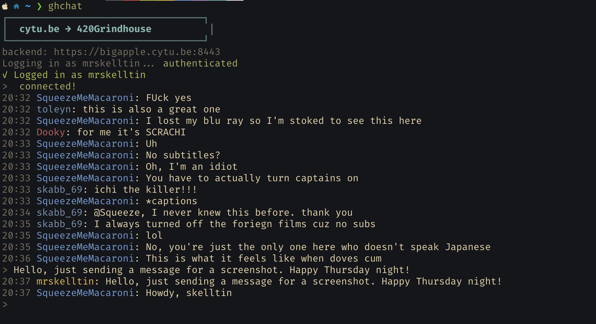

# cytube-cli

Terminal chat client for [cytu.be](https://cytu.be) rooms. Connects via Socket.IO, prints chat with colored usernames, and lets you send messages when logged in.



## Install

```bash
# Option A: pip install from GitHub
pip install git+https://github.com/vacuumboots/cytube-cli.git

# Option B: clone and install locally
git clone https://github.com/vacuumboots/cytube-cli.git
cd cytube-cli
python3 -m venv .venv
source .venv/bin/activate
pip install -r requirements.txt
```

## Usage

```bash
cytube-chat 420Grindhouse                        # guest (read-only)
cytube-chat 420Grindhouse --login myname         # login (reads .env)
cytube-chat 420Grindhouse --login myname --password mypass

# Flags
cytube-chat 420Grindhouse --hide-joins --hide-usercount --no-motd
cytube-chat 420Grindhouse --log chat.log         # log messages to file
cytube-chat --version                            # print version
```

Also works as `python3 -m cytube_cli`.

## Authentication

Credentials are resolved in this order:

1. `--login` / `--password` CLI flags
2. `CYTUBE_USERNAME` / `CYTUBE_PASSWORD` environment variables (set in `.env` or exported)
3. `~/.cytube_creds` file (username on line 1, password on line 2)

To use a `.env` file:

```bash
cp .env.example .env
# Edit .env with your credentials
```

## Chat commands

| Command   | Action                  |
|-----------|-------------------------|
| `/help`   | Show available commands |
| `/quit`   | Disconnect and exit     |
| `/names`  | List users in the room  |

Anything else is sent as a chat message.

## How it works

- Fetches the channel's Socket.IO backend from `/socketconfig/{channel}.json`
- Authenticates via HTTP login to get an auth cookie
- Connects via Socket.IO (WebSocket with polling fallback)
- Renders messages with consistent colored usernames (deterministic MD5-based color hashing)
- Supports cytu.be message types: standard chat, `/me` actions, emotes, announcements, server whispers, and drink events
- Auto-reconnects with exponential backoff on connection loss (1s → 2s → 4s → … → 30s max)

## License

MIT — see [LICENSE](LICENSE)
